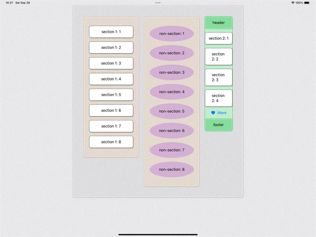

# SwiftUI WidgetKit Demo
Demos for building custom Container View (like `List`) handling `sections`, `subviews`, and allowing customization using `ContainerValues`.

For more details, please check out [SwiftUI: Build Our Own Container]().
