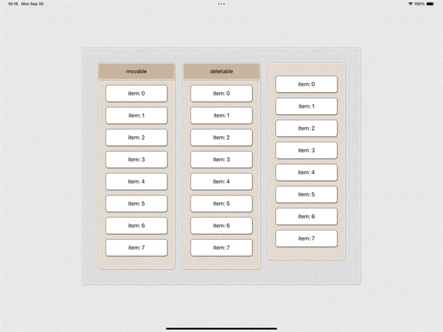

# SwiftUI Custom Container Demo
Demos for building custom Container View (like `List`) handling `sections`, `subviews`, and allowing customization using `ContainerValues`.


## Basic Board View (V5)
A Container with the ability to
- set styles on sections and subviews,
- expand and hide items if greater than a give number (or display them all)

[Sample Usage](./CustomContainerDemo/Progress/V5.swift):

```
struct V5ContentView: View {
    let items = [1, 2, 3, 4, 5, 6, 7, 8]

    var body: some View {

        BoardViewV5(content: {
            Section {
                ForEach(items, id:\.self) { item in
                    Text("section 1: \(item)")
                }
            }

            ForEach(items, id:\.self) { item in
                Text("non-section: \(item)")
                    .cardBackground({Ellipse()
                        .background(Color.clear)
                        .foregroundColor(.purple)
                        .opacity(0.3)})
                    .cardPadding(.vertical, 24)
            }

            Section(content: {
                ForEach(items, id:\.self) { item in
                    Text("section 2: \(item)")
                }
            }, header: {
                Text("header")
            }, footer: {
                Text("footer")
            })
            .sectionPadding(0, 0)
            .maxItemCount(4)
            .moreButtonLabel({
                HStack {
                    Image(systemName: "heart.fill")
                    Text("More")
                }
            })
            .hideButtonLabel({
                HStack {
                    Image(systemName: "heart.fill")
                    Text("Less")
                }
            })
            .sectionWidth(120)
            .sectionBackgroundStyle(.green, .init(lineWidth: 2.0))


        })
        .frame(maxHeight: .infinity, alignment: .top)
    }
}

```


For more details, please check out [SwiftUI: Build Our Own Container](https://medium.com/@itsuki.enjoy/swiftui-build-our-own-container-f8dacdcedb89).


## Board View + Editable (V10)
In addition to the abilities above, items are editable.
- Drag and Drop
- Delete

Specifically, (similar to `List`), we can
- enable or disable a specific item from being moved or delete
- add custom move actions or enable an individual section to support drag and drop by using `movable` (similar to [`onMove(perform:)`](https://developer.apple.com/documentation/swiftui/dynamicviewcontent/onmove(perform:)))
- add custom delete actions or enable an individual section to support delete by using `deletable` (similar to [`onDelete(perform:)`](https://developer.apple.com/documentation/swiftui/dynamicviewcontent/ondelete(perform:)))


### Important
**Different from `List`**, when initializing the `Board` View with individual section (implicitly with `ForEach` or explicitly with `Section`), in order for the list to be editable, attach the specific modifier needed.
- To enable drag and drop, attach `movable`
- To enable delete, attach `deletable`


[Sample Usage](./CustomContainerDemo/Progress/V10.swift):
```
@State var items = [0, 1, 2, 3, 4, 5, 6, 7]

//...

// initializing directly from the initializer.
// drag and drop, delete disabled for specific item
HStack {

    // all actions
    BoardViewV10($items, id: \.self, editActions: .all, rowContent: { $item in
        Text("Item: \(item)")
            .itemDeleteDisabled(item == 2)
            .itemMoveDisabled(item == 5)
    })
    .frame(maxHeight: .infinity, alignment: .top)


    // move (drag and drop) only
    BoardViewV10($items, id: \.self, editActions: .move, rowContent: { $item in
        Text("Item: \(item)")
            .itemDeleteDisabled(item == 2)
            .itemMoveDisabled(item == 5)
    })
    .frame(maxHeight: .infinity, alignment: .top)


    // delete only
    BoardViewV10($items, id: \.self, editActions: .delete, rowContent: { $item in
        Text("Item: \(item)")
            .itemDeleteDisabled(item == 2)
            .itemMoveDisabled(item == 5)
    })
    .frame(maxHeight: .infinity, alignment: .top)
}

// drag and drop, delete for individual section
BoardViewV10 {
    Section {
        ForEach(items, id: \.self) { item in
            Text("item: \(item)")
        }
    } header: {
        Text("movable")
    }
    .movable(perform: { from, to in
        items.move(fromOffsets: IndexSet(integer: from), toOffset: Int((to > from ? (to + 1) : to)))
    })

    Section {
        ForEach(items, id: \.self) { item in
            Text("item: \(item)")
        }
        .deletable(perform: { index in
            withAnimation {
                items.remove(atOffsets: IndexSet(integer: index))
            }
        })
    } header: {
        Text("deletable")
    }


    ForEach(items, id: \.self) { item in
        Text("item: \(item)")
    }
    .movable(perform: { from, to in
        items.move(fromOffsets: IndexSet(integer: from), toOffset: Int((to > from ? (to + 1) : to)))
    })
    .deletable(perform: { index in
        withAnimation {
            items.remove(atOffsets: IndexSet(integer: index))
        }
    })
}


// Custom editable action
HStack {

    // with initializer: always move the item to the top + a bouncy delete animation
    BoardViewV10($items, id: \.self) { $item in
        Text("Item: \(item)")
            .movable(perform: { from, to in
                items.move(fromOffsets: IndexSet(integer: from), toOffset: 0)
            })
            .deletable(perform: { index in
                withAnimation(.bouncy(extraBounce: 0.3)) {
                    items.remove(atOffsets: IndexSet(integer: index))
                }
            })
    }

    // with section: re-sort the list after delete
    BoardViewV10 {
        Section {
            ForEach(items, id: \.self) { item in
                Text("item: \(item)")
            }
        } header: {
            Text("sort after delete")
        }
        .movable(perform: { from, to in
            items.move(fromOffsets: IndexSet(integer: from), toOffset: Int((to > from ? (to + 1) : to)))
        })
        .deletable(perform: { index in
            withAnimation {
                items.remove(atOffsets: IndexSet(integer: index))
                items.sort(by: {$0<$1})
            }
        })
    }
}

```




For more details, please check out [SwiftUI: Custom Editable Container View](https://medium.com/gitconnected/swiftui-custom-container-view-editable-c48870e74b0f).
